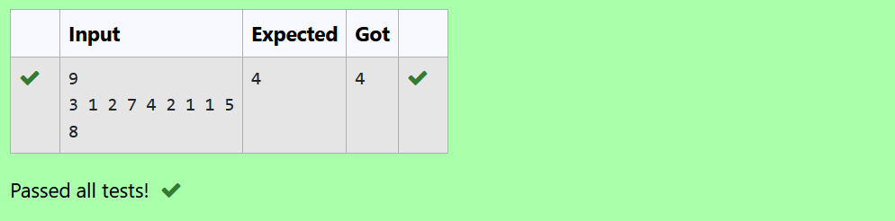
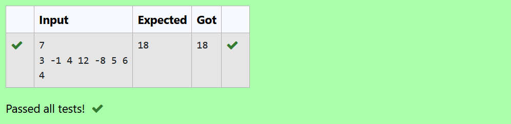
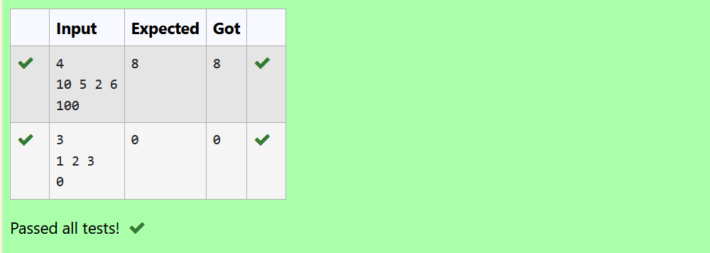
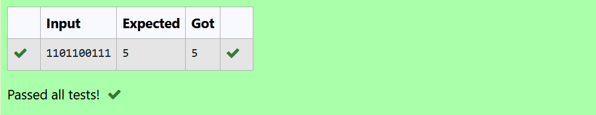

# Stack

## 1. Longest subarray sum less than or equal to k

**Problem Statement:** 

Given an array of positive integers nums and an integer k, find the length of the longest subarray whose sum is less than or equal to k. 

**Output:**

## 2. Maximum sum subarray of length k

**Problem Statement:** 

Given an integer array nums and an integer k, find the sum of the subarray with the largest sum whose length is k.

**Output:**

## 3. Count of contiguous subarrays with product less than k

**Problem Statement:** 

Given an array of integers nums and an integer k, return the number of contiguous subarrays where the product of all the elements in the subarray is strictly less than k.

**Constraints:**
- 1 <= nums.length <= 3 * 10^4
- 1 <= nums[i] <= 1000
- 0 <= k <= 10^6

**Output:**

**Explanation:**

For testcase 1, the 8 subarrays that have product less than 100 are: [10], [5], [2], [6], [10, 5], [5, 2], [2, 6], [5, 2, 6]. Note that [10, 5, 2] is not included as the product of 100 is not strictly less than k.

## 4. Longest substring after one flip

**Problem Statement:** 

You are given a binary string s (a string containing only "0" and "1"). You may choose up to one "0" and flip it to a "1". What is the length of the longest substring achievable that contains only "1"?

For example, given s = "1101100111", the answer is 5. If you perform the flip at index 2, the string becomes 1111100111.

**Output:**

